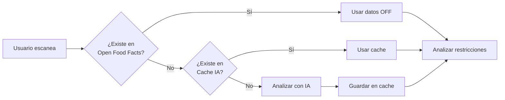
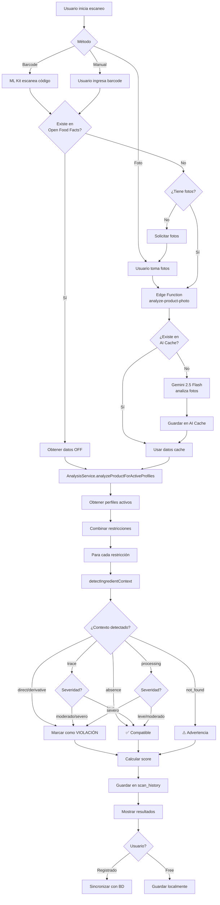
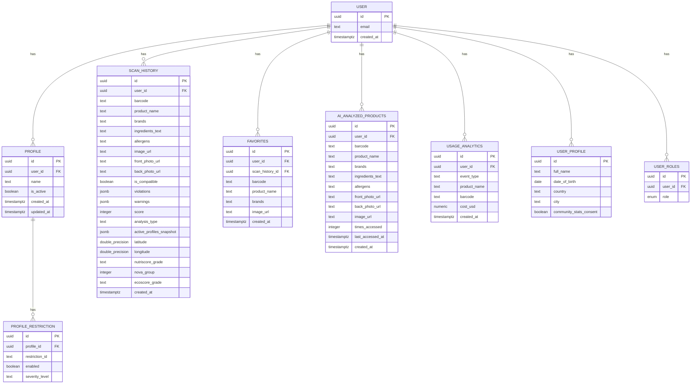
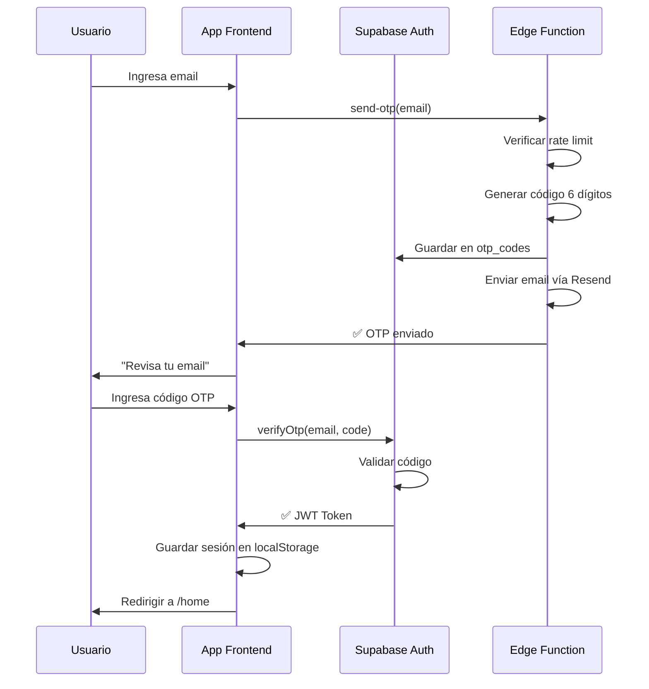

# LabelGuard - Documentación Técnica Completa

## Tabla de Contenidos

1. [Resumen Ejecutivo](#resumen-ejecutivo)
2. [¿Qué es LabelGuard?](#qué-es-labelguard)
3. [Características Principales](#características-principales)
4. [Sistema de Niveles de Severidad](#sistema-de-niveles-de-severidad)
5. [Stack Tecnológico](#stack-tecnológico)
6. [Arquitectura del Sistema](#arquitectura-del-sistema)
7. [Flujo de Análisis de Productos](#flujo-de-análisis-de-productos)
8. [Servicios y Componentes Principales](#servicios-y-componentes-principales)
9. [Base de Datos](#base-de-datos)
10. [Seguridad y Privacidad](#seguridad-y-privacidad)
11. [Modelo de Negocio](#modelo-de-negocio)
12. [Casos de Uso](#casos-de-uso)
13. [Roadmap y Futuro](#roadmap-y-futuro)

---

## Resumen Ejecutivo

**LabelGuard** es una aplicación móvil y web progresiva (PWA) diseñada para ayudar a personas con restricciones alimentarias a identificar rápidamente si un producto es compatible con sus necesidades dietéticas. La aplicación combina análisis de código de barras, reconocimiento de imágenes con IA, y una base de datos alimentaria global para proporcionar información instantánea y precisa.

### Problema que resuelve

Millones de personas viven con alergias alimentarias, intolerancias, restricciones dietéticas o creencias religiosas que limitan su alimentación. Leer e interpretar etiquetas de productos puede ser:

- **Tedioso y lento**: Leer ingredientes en letra pequeña
- **Confuso**: Terminología técnica y nombres científicos
- **Riesgoso**: No detectar trazas o ingredientes derivados
- **Frustrante**: Comprar productos inadecuados por error

### Solución

LabelGuard ofrece análisis instantáneo mediante:

1. **Escaneo de código de barras** con ML Kit
2. **Análisis de foto con IA** (Google Gemini)
3. **Búsqueda manual** en base de datos Open Food Facts
4. **Sistema de perfiles múltiples** con restricciones configurables
5. **Niveles de severidad personalizables** (Leve, Moderado, Severo)

---

## ¿Qué es LabelGuard?

LabelGuard es una plataforma multiplataforma (web y móvil) que permite a los usuarios:

### Para Usuarios FREE (No registrados)

- ✅ Escanear códigos de barras
- ✅ Analizar fotos de productos
- ✅ Configurar restricciones de **alérgenos principales** (8 alérgenos más comunes)
- ✅ Un solo perfil
- ✅ Historial local (no persistente)

### Para Usuarios PREMIUM (Registrados)

- ✅ **Todo lo de FREE**, más:
- ✅ **Hasta 5 perfiles** (familia, amigos, diferentes niveles de severidad)
- ✅ **Restricciones completas**: Dietéticas, Religiosas, Salud
- ✅ **Niveles de severidad configurables** por restricción
- ✅ **Historial persistente** en la nube
- ✅ **Favoritos sincronizados**
- ✅ **Comparación de productos**
- ✅ **Análisis geolocalizado** (saber dónde escaneaste)
- ✅ **Estadísticas de uso**

---

## Características Principales

### 1. Sistema de Perfiles Múltiples

Los usuarios premium pueden crear hasta **5 perfiles** independientes, cada uno con sus propias restricciones y niveles de severidad.

**Ejemplo de uso:**

- **Perfil "Mamá"**: Intolerancia a lactosa (Severo)
- **Perfil "Juan (hijo)"**: Alergia a cacahuetes (Severo), Gluten (Moderado)
- **Perfil "María (hija)"**: Vegetariana (Moderado)
- **Perfil "Abuela"**: Diabética - Sin azúcares añadidos (Moderado)
- **Perfil "Visitas"**: Kosher (Severo)

Cada perfil puede activarse/desactivarse para análisis simultáneo.

### 2. Escaneo de Código de Barras

Utiliza **Google ML Kit Barcode Scanner** para reconocer:

- EAN-13 / EAN-8 (Europa)
- UPC-A / UPC-E (América)
- Código 128 / Código 39
- QR Codes

**Flujo:**
1. Usuario abre el escáner
2. Apunta la cámara al código de barras
3. ML Kit detecta el código automáticamente
4. Se consulta Open Food Facts
5. Si no existe, se permite análisis por foto con IA

### 3. Análisis de Fotos con IA (Google Gemini)

Cuando un producto no está en Open Food Facts, el usuario puede fotografiar:

- **Foto frontal**: Extrae el nombre del producto
- **Foto trasera**: Extrae ingredientes, alérgenos y advertencias

**Tecnología:**
- Google Gemini 2.5 Flash (vía Lovable AI)
- Procesamiento de imágenes en Edge Functions
- Caché de productos analizados para reducir costos

### 4. Sistema de Cache Inteligente

Para optimizar costos de IA y velocidad:



### 5. Historial y Favoritos

- **Historial**: Registra todos los escaneos con timestamp, geolocalización, resultado de análisis
- **Favoritos**: Permite marcar productos compatibles para recompra rápida
- **Comparación**: Compara hasta 3 productos lado a lado

---

## Sistema de Niveles de Severidad

### Concepto

No todas las restricciones son iguales. Una persona con alergia severa a cacahuetes debe evitar incluso trazas microscópicas, mientras que alguien con intolerancia leve a la lactosa puede tolerar productos con "puede contener trazas de leche".

LabelGuard implementa **3 niveles de severidad** que modifican el algoritmo de detección:

### Niveles de Severidad

| Nivel | Emoji | Descripción | Ejemplo |
|-------|-------|-------------|---------|
| **Leve** 🟢 | Verde | Tolera trazas y menciones indirectas como "puede contener" | Intolerancia leve a lactosa |
| **Moderado** 🟡 | Amarillo | Rechaza ingredientes directos y trazas explícitas, pero tolera procesamiento compartido | Vegetarianismo, Gluten (celíaco leve) |
| **Severo** 🔴 | Rojo | Rechaza cualquier mención, incluso procesamiento cruzado o "fabricado en instalaciones que procesan..." | Alergia anafiláctica a cacahuetes |

### Restricciones que Soportan Severidad

Solo las restricciones donde tiene sentido detectar trazas/derivados soportan niveles de severidad:

**✅ Soportan severidad:**
- Alérgenos (gluten, lácteos, cacahuetes, etc.)
- Restricciones dietéticas con derivados (vegetariano/vegano con gelatina, etc.)

**❌ No soportan severidad:**
- Restricciones binarias (Halal, Kosher, Alcohol)
- Condiciones de salud específicas (diabetes, hipertensión)

### Algoritmo de Detección Contextual

El servicio `AnalysisService` implementa un sistema de detección contextual que clasifica cada keyword encontrada según su **contexto de aparición**:

```typescript
type IngredientContext = 
  | 'direct'              // "Contiene cacahuetes"
  | 'derivative'          // "Aceite de cacahuete"
  | 'trace'               // "Puede contener trazas de cacahuetes"
  | 'processing'          // "Fabricado en instalaciones que procesan cacahuetes"
  | 'absence'             // "Sin cacahuetes"
  | 'not_found';          // No se encontró mención
```

**Ejemplo de Detección:**

```typescript
// Texto de ingredientes: 
"Harina de trigo, azúcar, aceite de cacahuete. Puede contener trazas de soja. 
Fabricado en instalaciones que procesan frutos secos."

// Para restricción "Cacahuetes":
{
  context: 'derivative',  // "aceite de cacahuete"
  confidence: 'high',
  matchedKeyword: 'cacahuete'
}

// Para restricción "Soja":
{
  context: 'trace',       // "puede contener trazas de soja"
  confidence: 'medium',
  matchedKeyword: 'soja'
}

// Para restricción "Frutos secos":
{
  context: 'processing',  // "instalaciones que procesan frutos secos"
  confidence: 'low',
  matchedKeyword: 'frutos secos'
}
```

### Tabla de Decisión por Severidad

| Contexto | Leve 🟢 | Moderado 🟡 | Severo 🔴 |
|----------|---------|-------------|----------|
| `direct` | ❌ Rechaza | ❌ Rechaza | ❌ Rechaza |
| `derivative` | ❌ Rechaza | ❌ Rechaza | ❌ Rechaza |
| `trace` | ✅ Tolera | ❌ Rechaza | ❌ Rechaza |
| `processing` | ✅ Tolera | ✅ Tolera | ❌ Rechaza |
| `absence` | ✅ Acepta | ✅ Acepta | ✅ Acepta |

### Ejemplos Prácticos

#### Ejemplo 1: Producto con Trazas de Leche

**Producto:** Chocolate negro 85%  
**Ingredientes:** "Pasta de cacao, azúcar, manteca de cacao. Puede contener trazas de leche."

**Análisis para "Lácteos":**

| Usuario | Severidad | Resultado | Explicación |
|---------|-----------|-----------|-------------|
| Ana | Leve 🟢 | ✅ **Compatible** | Tolera trazas, solo evita lácteos directos |
| Carlos | Moderado 🟡 | ❌ **Incompatible** | No tolera trazas explícitas |
| Marta | Severo 🔴 | ❌ **Incompatible** | Rechaza cualquier mención de lácteos |

#### Ejemplo 2: Producto Vegano con Advertencia de Procesamiento

**Producto:** Hamburguesa vegetal  
**Ingredientes:** "Proteína de soja, aceite de girasol, especias. Fabricado en instalaciones que procesan carne."

**Análisis para "Carne" (Vegetariano/Vegano):**

| Usuario | Severidad | Resultado | Explicación |
|---------|-----------|-----------|-------------|
| Luis (Vegetariano) | Leve 🟢 | ✅ **Compatible** | Tolera procesamiento compartido |
| Sara (Vegetariana) | Moderado 🟡 | ✅ **Compatible** | Tolera procesamiento compartido |
| Pedro (Vegano) | Severo 🔴 | ❌ **Incompatible** | Rechaza incluso instalaciones compartidas |

#### Ejemplo 3: Producto con Gluten Directo

**Producto:** Pan de molde  
**Ingredientes:** "Harina de trigo, agua, levadura, sal."

**Análisis para "Gluten":**

| Usuario | Severidad | Resultado | Explicación |
|---------|-----------|-----------|-------------|
| Todos | Cualquiera | ❌ **Incompatible** | Gluten directo se rechaza siempre |

### Implementación Técnica del Sistema

El algoritmo principal está en `src/services/analysisService.ts`:

```typescript
private static detectIngredientContext(
  productText: string,
  allergenText: string,
  productName: string,
  keywords: string[]
): { context: IngredientContext; confidence: 'high' | 'medium' | 'low'; matchedKeyword?: string } {
  
  const fullText = `${productText} ${allergenText} ${productName}`.toLowerCase();
  
  // 1. Detección de ausencia explícita
  const absencePatterns = [
    /sin\s+\w*\s*\b(keyword)\b/gi,
    /libre\s+de\s+\b(keyword)\b/gi,
    /no\s+contiene\s+\b(keyword)\b/gi,
    // ... más patrones
  ];
  
  for (const keyword of keywords) {
    for (const pattern of absencePatterns) {
      if (pattern.test(fullText)) {
        return { context: 'absence', confidence: 'high' };
      }
    }
  }
  
  // 2. Detección de trazas
  const tracePatterns = [
    /puede\s+contener\s+(trazas\s+de\s+)?\b(keyword)\b/gi,
    /trazas\s+de\s+\b(keyword)\b/gi,
    // ... más patrones
  ];
  
  // 3. Detección de procesamiento cruzado
  const processingPatterns = [
    /(fabricado|procesado|elaborado)\s+en\s+(instalaciones|líneas)\s+que\s+(procesan|manipulan|trabajan\s+con)\s+\b(keyword)\b/gi,
    // ... más patrones
  ];
  
  // 4. Detección de derivados
  const derivativePatterns = [
    /(aceite|extracto|harina|polvo|proteína|suero|grasa)\s+de\s+\b(keyword)\b/gi,
    // ... más patrones
  ];
  
  // 5. Detección directa
  for (const keyword of keywords) {
    if (fullText.includes(keyword.toLowerCase())) {
      return { context: 'direct', confidence: 'high', matchedKeyword: keyword };
    }
  }
  
  return { context: 'not_found', confidence: 'high' };
}
```

**Lógica de Rechazo:**

```typescript
private static shouldReject(
  context: IngredientContext,
  severityLevel: SeverityLevel
): boolean {
  // Siempre rechazar presencia directa y derivados
  if (context === 'direct' || context === 'derivative') {
    return true;
  }
  
  // Rechazar trazas según severidad
  if (context === 'trace') {
    return severityLevel !== 'leve'; // Solo nivel leve tolera trazas
  }
  
  // Rechazar procesamiento cruzado solo en nivel severo
  if (context === 'processing') {
    return severityLevel === 'severo';
  }
  
  // No rechazar si no se encontró o hay ausencia explícita
  return false;
}
```

---

## Stack Tecnológico

### Frontend

| Tecnología | Versión | Propósito |
|------------|---------|-----------|
| **React** | 18.3.1 | Framework UI |
| **TypeScript** | 5.x | Tipado estático |
| **Vite** | 5.x | Build tool y dev server |
| **Tailwind CSS** | 3.x | Estilos utility-first |
| **shadcn/ui** | Latest | Componentes UI |
| **React Router** | 6.26.2 | Enrutamiento |
| **TanStack Query** | 5.56.2 | Cache y gestión de estado asíncrono |
| **Zod** | 3.23.8 | Validación de esquemas |
| **React Hook Form** | 7.53.0 | Gestión de formularios |
| **Lucide React** | 0.462.0 | Iconos |
| **Sonner** | 1.5.0 | Sistema de notificaciones (toasts) |

### Backend (Lovable Cloud - Supabase)

| Componente | Tecnología | Propósito |
|------------|------------|-----------|
| **Base de datos** | PostgreSQL 15 | Almacenamiento principal |
| **Autenticación** | Supabase Auth | JWT, OAuth, Email |
| **Almacenamiento** | Supabase Storage | Fotos de productos |
| **Edge Functions** | Deno Runtime | Lógica serverless |
| **Row Level Security** | PostgreSQL RLS | Seguridad a nivel de fila |

### Mobile

| Tecnología | Versión | Propósito |
|------------|---------|-----------|
| **Capacitor** | 7.4.2 | Wrapper nativo iOS/Android |
| **ML Kit Barcode** | 7.3.0 | Escaneo de códigos |
| **Capacitor Camera** | 7.0.1 | Acceso a cámara |
| **Capacitor Geolocation** | 7.1.5 | GPS |
| **Capacitor Share** | 7.0.2 | Compartir resultados |

### APIs Externas

| API | Propósito | Proveedor |
|-----|-----------|-----------|
| **Open Food Facts** | Base de datos alimentaria | https://world.openfoodfacts.org |
| **Lovable AI** | Análisis de fotos con IA | Google Gemini 2.5 Flash |
| **Resend** | Envío de emails (OTP, confirmación) | Resend.com |

### Infraestructura

- **Hosting Frontend**: Lovable CDN
- **Hosting Backend**: Supabase Cloud (Lovable Cloud)
- **Edge Functions**: Deno Deploy (vía Supabase)
- **Storage**: Supabase Storage (S3-compatible)

---

## Arquitectura del Sistema

### Estructura de Carpetas

```
labelguard/
├── src/
│   ├── components/          # Componentes reutilizables
│   │   ├── ui/              # shadcn/ui components
│   │   ├── Layout.tsx       # Layout principal
│   │   ├── Navigation.tsx   # Navegación
│   │   ├── ProfileCard.tsx  # Tarjeta de perfil
│   │   ├── CreateProfileDialog.tsx
│   │   └── ...
│   ├── contexts/            # Context API
│   │   └── AuthContext.tsx  # Estado de autenticación
│   ├── pages/               # Páginas/Rutas
│   │   ├── Index.tsx        # Landing page
│   │   ├── Home.tsx         # Dashboard (sin auth)
│   │   ├── Scanner.tsx      # Escáner de barras
│   │   ├── PhotoAnalysis.tsx # Análisis por foto
│   │   ├── Results.tsx      # Resultados de análisis
│   │   ├── History.tsx      # Historial
│   │   ├── Favorites.tsx    # Favoritos
│   │   ├── Profile.tsx      # Gestión de perfiles
│   │   └── Auth.tsx         # Login/Signup
│   ├── services/            # Lógica de negocio
│   │   ├── analysisService.ts       # Análisis de restricciones
│   │   ├── profileService.ts        # Gestión de perfiles
│   │   ├── openFoodFactsService.ts  # Integración OFF API
│   │   ├── photoAnalysisService.ts  # Análisis con IA
│   │   ├── aiProductCacheService.ts # Cache de productos IA
│   │   ├── historyService.ts        # Historial
│   │   ├── favoritesService.ts      # Favoritos
│   │   ├── cameraService.ts         # Cámara/Barcode
│   │   └── geolocationService.ts    # GPS
│   ├── data/
│   │   └── restrictions.ts  # Catálogo de restricciones
│   ├── types/
│   │   ├── restrictions.ts  # Tipos de restricciones
│   │   └── insights.ts      # Tipos de analytics
│   ├── integrations/
│   │   └── supabase/
│   │       ├── client.ts    # Cliente Supabase (auto-generado)
│   │       └── types.ts     # Tipos DB (auto-generado)
│   ├── config/
│   │   └── app.ts           # Configuración global
│   └── main.tsx             # Entry point
├── supabase/
│   ├── functions/           # Edge Functions
│   │   ├── analyze-product-photo/
│   │   │   └── index.ts
│   │   ├── send-otp/
│   │   │   └── index.ts
│   │   ├── send-confirmation-email/
│   │   │   └── index.ts
│   │   └── admin-insights/
│   │       └── index.ts
│   ├── migrations/          # Migraciones SQL (auto-generado)
│   └── config.toml          # Config Supabase
├── public/                  # Assets estáticos
├── capacitor.config.ts      # Config Capacitor
├── tailwind.config.ts       # Config Tailwind
└── vite.config.ts           # Config Vite
```

### Patrones de Diseño

#### 1. Service Layer Pattern

Toda la lógica de negocio está encapsulada en servicios:

```typescript
// src/services/analysisService.ts
export class AnalysisService {
  static async analyzeProductForActiveProfiles(
    product: ProductInfo
  ): Promise<AnalysisResult> {
    // Lógica compleja de análisis
  }
}
```

#### 2. Context API para Estado Global

```typescript
// src/contexts/AuthContext.tsx
export const AuthProvider = ({ children }) => {
  const [user, setUser] = useState<User | null>(null);
  const [loading, setLoading] = useState(true);
  
  // ... lógica de autenticación
  
  return (
    <AuthContext.Provider value={{ user, loading, signIn, signOut }}>
      {children}
    </AuthContext.Provider>
  );
};
```

#### 3. Singleton Services

Los servicios son clases con métodos estáticos (singleton implícito):

```typescript
export class ProfileService {
  private static userId: string | null = null;
  
  static async initialize(userId?: string): Promise<void> {
    // Inicialización única
  }
}
```

#### 4. Repository Pattern

Cada servicio actúa como repositorio para su dominio:

```typescript
export class HistoryService {
  static async saveToHistory(/* ... */): Promise<void> { /* ... */ }
  static async getHistory(): Promise<ScanHistoryItem[]> { /* ... */ }
  static async deleteHistoryItem(id: string): Promise<void> { /* ... */ }
}
```

#### 5. Strategy Pattern (Severidad)

El análisis cambia su estrategia según el nivel de severidad:

```typescript
private static shouldReject(
  context: IngredientContext,
  severityLevel: SeverityLevel
): boolean {
  // Diferentes estrategias según severityLevel
}
```

#### 6. Observer Pattern (TanStack Query)

Los componentes observan cambios en los datos:

```typescript
const { data: profiles, refetch } = useQuery({
  queryKey: ['profiles'],
  queryFn: () => ProfileService.getProfiles()
});
```

---

## Flujo de Análisis de Productos

### Diagrama de Flujo Completo



### Código del Flujo Principal

```typescript
// src/pages/Scanner.tsx - Escaneo de barcode
const handleBarCodeScanned = async (barcode: string) => {
  setScanning(false);
  
  try {
    // 1. Buscar en Open Food Facts
    const product = await OpenFoodFactsService.getProduct(barcode);
    
    if (product) {
      // 2. Analizar contra perfiles activos
      const analysis = await AnalysisService.analyzeProductForActiveProfiles(product);
      
      // 3. Guardar en historial
      await HistoryService.saveToHistory(product, analysis, 'barcode');
      
      // 4. Navegar a resultados
      navigate('/results', { 
        state: { product, analysis, analysisType: 'barcode' } 
      });
    } else {
      // No existe en OFF, solicitar fotos
      toast.info('Producto no encontrado. Intenta con análisis de fotos.');
      navigate('/photo-analysis', { state: { barcode } });
    }
  } catch (error) {
    console.error('Error analyzing product:', error);
    toast.error('Error al analizar el producto');
  }
};
```

```typescript
// src/services/analysisService.ts - Análisis principal
static async analyzeProductForActiveProfiles(
  product: ProductInfo
): Promise<AnalysisResult> {
  // 1. Obtener perfiles activos
  const activeProfiles = await ProfileService.getActiveProfiles();
  
  if (activeProfiles.length === 0) {
    return {
      isCompatible: true,
      violations: [],
      warnings: ['No hay perfiles activos. Configura tus restricciones.'],
      score: 100
    };
  }
  
  // 2. Combinar restricciones de todos los perfiles activos
  const combinedProfile = this.combineAllRestrictions(activeProfiles);
  
  // 3. Analizar producto
  return this.analyzeProduct(product, combinedProfile);
}

static analyzeProduct(
  product: ProductInfo,
  profile: UserProfile
): AnalysisResult {
  const violations: AnalysisResult['violations'] = [];
  const warnings: string[] = [];
  
  const ingredients = product.ingredients_text?.toLowerCase() || '';
  const allergens = product.allergens?.toLowerCase() || '';
  const productName = product.product_name?.toLowerCase() || '';
  
  // 4. Analizar cada restricción habilitada
  profile.restrictions
    .filter(r => r.enabled)
    .forEach(restriction => {
      const detection = this.detectIngredientContext(
        ingredients,
        allergens,
        productName,
        restriction.keywords
      );
      
      // 5. Determinar si debe rechazarse según severidad
      const severityLevel = restriction.severityLevel || 'moderado';
      const shouldReject = this.shouldReject(detection.context, severityLevel);
      
      if (shouldReject) {
        violations.push({
          restriction: restriction.name,
          reason: this.getContextLabel(detection.context, detection.matchedKeyword),
          severity: this.getSeverity(restriction.category),
          severityLevel: severityLevel
        });
      } else if (detection.context === 'not_found' && restriction.keywords.length > 0) {
        warnings.push(
          `No se pudo verificar ${restriction.name}. Revisa manualmente.`
        );
      }
    });
  
  // 6. Calcular compatibilidad y score
  const isCompatible = violations.length === 0;
  const score = this.calculateCompatibilityScore(violations, warnings);
  
  return { isCompatible, violations, warnings, score };
}
```

---

## Servicios y Componentes Principales

### 1. AnalysisService

**Responsabilidad:** Analizar productos contra restricciones de perfiles activos.

**Métodos principales:**

```typescript
class AnalysisService {
  // Analiza producto contra todos los perfiles activos
  static async analyzeProductForActiveProfiles(
    product: ProductInfo
  ): Promise<AnalysisResult>
  
  // Analiza producto contra un perfil específico
  static analyzeProduct(
    product: ProductInfo,
    profile: UserProfile
  ): AnalysisResult
  
  // Combina restricciones de múltiples perfiles (prioriza mayor severidad)
  private static combineAllRestrictions(
    profiles: Profile[]
  ): UserProfile
  
  // Detecta contexto de un ingrediente
  private static detectIngredientContext(
    productText: string,
    allergenText: string,
    productName: string,
    keywords: string[]
  ): { context: IngredientContext; confidence: string; matchedKeyword?: string }
  
  // Determina si debe rechazarse según severidad
  private static shouldReject(
    context: IngredientContext,
    severityLevel: SeverityLevel
  ): boolean
  
  // Calcula score de compatibilidad (0-100)
  private static calculateCompatibilityScore(
    violations: Violation[],
    warnings: string[]
  ): number
  
  // Obtiene color del score
  static getScoreColor(score: number): string
  
  // Obtiene etiqueta del score
  static getScoreLabel(score: number): string
}
```

**Ejemplo de uso:**

```typescript
const product = await OpenFoodFactsService.getProduct('5449000000996');
const analysis = await AnalysisService.analyzeProductForActiveProfiles(product);

console.log(analysis);
// {
//   isCompatible: false,
//   violations: [
//     {
//       restriction: 'Gluten',
//       reason: 'Contiene harina de trigo (ingrediente directo)',
//       severity: 'high',
//       severityLevel: 'severo'
//     }
//   ],
//   warnings: [],
//   score: 0
// }
```

### 2. ProfileService

**Responsabilidad:** Gestionar perfiles de usuario (CRUD, sincronización local/nube).

**Métodos principales:**

```typescript
class ProfileService {
  // Inicializa el servicio (detecta FREE vs PREMIUM)
  static async initialize(userId?: string): Promise<void>
  
  // Crea un perfil
  static async createProfile(name: string): Promise<boolean>
  
  // Obtiene todos los perfiles
  static async getProfiles(): Promise<Profile[]>
  
  // Obtiene perfiles activos
  static async getActiveProfiles(): Promise<Profile[]>
  
  // Obtiene un perfil por ID
  static async getProfile(id: string): Promise<Profile | null>
  
  // Actualiza un perfil
  static async updateProfile(
    id: string,
    updates: Partial<Profile>
  ): Promise<boolean>
  
  // Elimina un perfil
  static async deleteProfile(id: string): Promise<boolean>
  
  // Activa/desactiva un perfil
  static async toggleProfileActive(id: string): Promise<boolean>
  
  // Verifica si puede crear más perfiles
  static async canCreateProfile(): Promise<boolean>
  
  // Obtiene restricciones disponibles (FREE: solo alérgenos)
  static async getAvailableRestrictions(): Promise<DietaryRestriction[]>
  
  // Migra datos locales a la nube al registrarse
  static async migrateLocalToCloud(userId: string): Promise<void>
}
```

**Estructura de datos:**

```typescript
interface Profile {
  id: string;
  name: string;
  isActive: boolean;
  restrictions: DietaryRestriction[];
  createdAt: string;
}

interface DietaryRestriction {
  id: string;
  name: string;
  description: string;
  category: 'allergens' | 'dietary' | 'health' | 'religious';
  keywords: string[];
  enabled: boolean;
  isFree?: boolean; // true para alérgenos (FREE)
  severityLevel?: SeverityLevel;
  supportsSeverity?: boolean;
}
```

### 3. OpenFoodFactsService

**Responsabilidad:** Integración con Open Food Facts API.

**Métodos:**

```typescript
class OpenFoodFactsService {
  // Obtiene producto por código de barras
  static async getProduct(barcode: string): Promise<ProductInfo | null>
  
  // Busca productos por texto
  static async searchProducts(
    query: string,
    limit: number = 20
  ): Promise<ProductInfo[]>
}
```

**Ejemplo:**

```typescript
const product = await OpenFoodFactsService.getProduct('5449000000996');
// {
//   code: '5449000000996',
//   product_name: 'Coca-Cola',
//   brands: 'Coca-Cola',
//   ingredients_text: 'Agua carbonatada, azúcar, colorante E-150d...',
//   allergens: '',
//   nutriscore_grade: 'e',
//   nova_group: 4,
//   ecoscore_grade: 'c',
//   image_url: 'https://...'
// }
```

### 4. PhotoAnalysisService

**Responsabilidad:** Analizar fotos de productos con IA (Gemini).

**Métodos:**

```typescript
class PhotoAnalysisService {
  // Analiza foto frontal (nombre del producto)
  static async analyzeFrontPhoto(imageBase64: string): Promise<string>
  
  // Analiza foto trasera (ingredientes, alérgenos, advertencias)
  static async analyzeBackPhoto(imageBase64: string): Promise<{
    ingredients: string;
    allergens: string;
    warnings: string;
  }>
  
  // Sube foto a Storage
  static async uploadPhoto(
    photo: Blob,
    type: 'front' | 'back'
  ): Promise<string>
}
```

**Flujo:**

```typescript
// Usuario toma foto frontal
const frontBlob = await fetch(frontPhoto).then(r => r.blob());
const frontUrl = await PhotoAnalysisService.uploadPhoto(frontBlob, 'front');
const frontBase64 = await PhotoAnalysisService.blobToBase64(frontBlob);
const productName = await PhotoAnalysisService.analyzeFrontPhoto(frontBase64);

// Usuario toma foto trasera
const backBlob = await fetch(backPhoto).then(r => r.blob());
const backUrl = await PhotoAnalysisService.uploadPhoto(backBlob, 'back');
const backBase64 = await PhotoAnalysisService.blobToBase64(backBlob);
const { ingredients, allergens, warnings } = await PhotoAnalysisService.analyzeBackPhoto(backBase64);

// Construir ProductInfo sintético
const product: ProductInfo = {
  code: barcode || 'AI-ANALYZED',
  product_name: productName,
  brands: '',
  ingredients_text: ingredients,
  allergens: allergens,
  image_url: frontUrl
};
```

### 5. AIProductCacheService

**Responsabilidad:** Cachear productos analizados con IA para reducir costos.

**Métodos:**

```typescript
class AIProductCacheService {
  // Busca producto en cache
  static async getFromCache(barcode: string): Promise<ProductInfo | null>
  
  // Guarda producto en cache
  static async saveToCache(product: ProductInfo, barcode?: string): Promise<void>
  
  // Actualiza último acceso (para analytics)
  static async updateLastAccess(barcode: string): Promise<void>
}
```

**Tabla `ai_analyzed_products`:**

```sql
CREATE TABLE ai_analyzed_products (
  id UUID PRIMARY KEY DEFAULT gen_random_uuid(),
  user_id UUID NOT NULL,
  barcode TEXT,
  product_name TEXT NOT NULL,
  brands TEXT,
  ingredients_text TEXT,
  allergens TEXT,
  front_photo_url TEXT,
  back_photo_url TEXT,
  image_url TEXT,
  times_accessed INTEGER DEFAULT 1,
  last_accessed_at TIMESTAMPTZ DEFAULT now(),
  created_at TIMESTAMPTZ DEFAULT now()
);
```

### 6. Scanner.tsx

**Componente:** Escáner de código de barras con ML Kit.

**Características:**

- Detecta automáticamente códigos de barras
- Overlay visual con guía de escaneo
- Fallback a entrada manual si el escaneo falla
- Integración con servicios de análisis

**Código simplificado:**

```typescript
const Scanner = () => {
  const [scanning, setScanning] = useState(true);
  
  useEffect(() => {
    const startScanning = async () => {
      // Verificar permisos
      const hasPermission = await checkCameraPermission();
      if (!hasPermission) {
        toast.error('Permiso de cámara denegado');
        return;
      }
      
      // Iniciar escáner
      await BarcodeScanner.addListener('barcodeScanned', async (result) => {
        if (!scanning) return;
        
        const barcode = result.barcode.displayValue;
        await handleBarCodeScanned(barcode);
      });
      
      await BarcodeScanner.startScan();
    };
    
    startScanning();
    
    return () => {
      BarcodeScanner.stopScan();
      BarcodeScanner.removeAllListeners();
    };
  }, []);
  
  const handleBarCodeScanned = async (barcode: string) => {
    // ... (ver sección Flujo de Análisis)
  };
  
  return (
    <div className="relative w-full h-screen">
      <div className="scanner-overlay">
        <div className="scan-area">
          <p>Apunta al código de barras</p>
        </div>
      </div>
    </div>
  );
};
```

### 7. Results.tsx

**Componente:** Pantalla de resultados del análisis.

**Características:**

- Muestra compatibilidad (✅/❌)
- Lista de violaciones con severidad
- Score visual (0-100)
- Información nutricional (Nutri-Score, NOVA, Eco-Score)
- Botones: Favoritos, Compartir, Ver Historial

**Interfaz:**

```typescript
interface ResultsState {
  product: ProductInfo;
  analysis: AnalysisResult;
  analysisType: 'barcode' | 'photo' | 'manual';
}
```

**Vista:**

```
┌─────────────────────────────────────┐
│  [← Volver]         [★ Favorito]    │
├─────────────────────────────────────┤
│                                     │
│      [Imagen del producto]          │
│                                     │
│  Coca-Cola                          │
│  Coca-Cola Company                  │
│                                     │
├─────────────────────────────────────┤
│  ❌ INCOMPATIBLE CON TUS PERFILES   │
│                                     │
│  Score: 15/100 🔴                   │
├─────────────────────────────────────┤
│  ⚠️ VIOLACIONES DETECTADAS:         │
│                                     │
│  🔴 Azúcar (Severo)                 │
│     Contiene azúcar en exceso       │
│                                     │
│  🟡 Conservantes (Moderado)         │
│     Contiene E-211                  │
├─────────────────────────────────────┤
│  ℹ️ INFORMACIÓN NUTRICIONAL          │
│                                     │
│  Nutri-Score: E 🔴                  │
│  NOVA: 4 (Ultra-procesado) 🔴       │
│  Eco-Score: C 🟡                    │
├─────────────────────────────────────┤
│  [🔄 Escanear otro]  [📤 Compartir] │
└─────────────────────────────────────┘
```

---

## Base de Datos

### Esquema Completo



### Tablas Principales

#### 1. `profiles`

Almacena los perfiles de restricciones de usuarios premium.

```sql
CREATE TABLE profiles (
  id UUID PRIMARY KEY DEFAULT gen_random_uuid(),
  user_id UUID NOT NULL REFERENCES auth.users(id),
  name TEXT NOT NULL,
  is_active BOOLEAN DEFAULT false,
  created_at TIMESTAMPTZ DEFAULT now(),
  updated_at TIMESTAMPTZ DEFAULT now()
);

-- RLS Policies
ALTER TABLE profiles ENABLE ROW LEVEL SECURITY;

CREATE POLICY "Users can view own profiles"
  ON profiles FOR SELECT
  USING (auth.uid() = user_id);

CREATE POLICY "Users can insert own profiles"
  ON profiles FOR INSERT
  WITH CHECK (auth.uid() = user_id);

CREATE POLICY "Users can update own profiles"
  ON profiles FOR UPDATE
  USING (auth.uid() = user_id);

CREATE POLICY "Users can delete own profiles"
  ON profiles FOR DELETE
  USING (auth.uid() = user_id);

-- Trigger para updated_at
CREATE TRIGGER update_profiles_updated_at
  BEFORE UPDATE ON profiles
  FOR EACH ROW
  EXECUTE FUNCTION update_updated_at_column();

-- Trigger para limitar a 5 perfiles por usuario
CREATE TRIGGER check_profile_limit_trigger
  BEFORE INSERT ON profiles
  FOR EACH ROW
  EXECUTE FUNCTION check_profile_limit();
```

#### 2. `profile_restrictions`

Almacena las restricciones habilitadas de cada perfil con su nivel de severidad.

```sql
CREATE TABLE profile_restrictions (
  id UUID PRIMARY KEY DEFAULT gen_random_uuid(),
  profile_id UUID NOT NULL REFERENCES profiles(id) ON DELETE CASCADE,
  restriction_id TEXT NOT NULL,
  enabled BOOLEAN DEFAULT true,
  severity_level TEXT NOT NULL DEFAULT 'moderado'
    CHECK (severity_level IN ('leve', 'moderado', 'severo'))
);

-- RLS Policy
CREATE POLICY "Users can manage own profile restrictions"
  ON profile_restrictions FOR ALL
  USING (
    EXISTS (
      SELECT 1 FROM profiles
      WHERE profiles.id = profile_restrictions.profile_id
        AND profiles.user_id = auth.uid()
    )
  );
```

#### 3. `scan_history`

Historial de escaneos de usuarios registrados.

```sql
CREATE TABLE scan_history (
  id UUID PRIMARY KEY DEFAULT gen_random_uuid(),
  user_id UUID NOT NULL REFERENCES auth.users(id),
  barcode TEXT,
  product_name TEXT NOT NULL,
  brands TEXT,
  ingredients_text TEXT,
  allergens TEXT,
  image_url TEXT,
  front_photo_url TEXT,
  back_photo_url TEXT,
  is_compatible BOOLEAN NOT NULL,
  violations JSONB DEFAULT '[]'::jsonb,
  warnings JSONB DEFAULT '[]'::jsonb,
  score INTEGER NOT NULL,
  analysis_type TEXT NOT NULL,
  active_profiles_snapshot JSONB NOT NULL,
  latitude DOUBLE PRECISION,
  longitude DOUBLE PRECISION,
  nutriscore_grade TEXT,
  nova_group INTEGER,
  ecoscore_grade TEXT,
  created_at TIMESTAMPTZ DEFAULT now()
);

-- Índices
CREATE INDEX idx_scan_history_user_id ON scan_history(user_id);
CREATE INDEX idx_scan_history_created_at ON scan_history(created_at DESC);

-- RLS Policies
CREATE POLICY "Users can view own scan history"
  ON scan_history FOR SELECT
  USING (auth.uid() = user_id);

CREATE POLICY "Users can insert own scan history"
  ON scan_history FOR INSERT
  WITH CHECK (auth.uid() = user_id);

CREATE POLICY "Users can delete own scan history"
  ON scan_history FOR DELETE
  USING (auth.uid() = user_id);
```

#### 4. `favorites`

Productos favoritos de usuarios registrados.

```sql
CREATE TABLE favorites (
  id UUID PRIMARY KEY DEFAULT gen_random_uuid(),
  user_id UUID NOT NULL REFERENCES auth.users(id),
  scan_history_id UUID REFERENCES scan_history(id) ON DELETE SET NULL,
  barcode TEXT,
  product_name TEXT NOT NULL,
  brands TEXT,
  image_url TEXT,
  created_at TIMESTAMPTZ DEFAULT now()
);

-- RLS Policies
CREATE POLICY "Users can view own favorites"
  ON favorites FOR SELECT
  USING (auth.uid() = user_id);

CREATE POLICY "Users can insert own favorites"
  ON favorites FOR INSERT
  WITH CHECK (auth.uid() = user_id);

CREATE POLICY "Users can delete own favorites"
  ON favorites FOR DELETE
  USING (auth.uid() = user_id);
```

#### 5. `ai_analyzed_products`

Cache de productos analizados con IA.

```sql
CREATE TABLE ai_analyzed_products (
  id UUID PRIMARY KEY DEFAULT gen_random_uuid(),
  user_id UUID NOT NULL REFERENCES auth.users(id),
  barcode TEXT,
  product_name TEXT NOT NULL,
  brands TEXT,
  ingredients_text TEXT,
  allergens TEXT,
  front_photo_url TEXT,
  back_photo_url TEXT,
  image_url TEXT,
  times_accessed INTEGER DEFAULT 1,
  last_accessed_at TIMESTAMPTZ DEFAULT now(),
  created_at TIMESTAMPTZ DEFAULT now()
);

-- Índice único para evitar duplicados por usuario
CREATE UNIQUE INDEX idx_ai_products_user_barcode 
  ON ai_analyzed_products(user_id, barcode)
  WHERE barcode IS NOT NULL;

-- RLS Policies
CREATE POLICY "Users can read their own analyzed products"
  ON ai_analyzed_products FOR SELECT
  USING (auth.uid() = user_id);

CREATE POLICY "Users can insert their own analyzed products"
  ON ai_analyzed_products FOR INSERT
  WITH CHECK (auth.uid() = user_id);

CREATE POLICY "Users can update their own analyzed products"
  ON ai_analyzed_products FOR UPDATE
  USING (auth.uid() = user_id);

CREATE POLICY "Users can delete their own analyzed products"
  ON ai_analyzed_products FOR DELETE
  USING (auth.uid() = user_id);

-- Policy para admins
CREATE POLICY "Admins can read all analyzed products"
  ON ai_analyzed_products FOR SELECT
  USING (has_role(auth.uid(), 'admin'::app_role));
```

#### 6. `ai_analysis_rate_limit`

Control de rate limiting para análisis con IA (prevenir abuso).

```sql
CREATE TABLE ai_analysis_rate_limit (
  id UUID PRIMARY KEY DEFAULT gen_random_uuid(),
  user_id UUID NOT NULL,
  window_start TIMESTAMPTZ NOT NULL DEFAULT now(),
  analysis_count INTEGER NOT NULL DEFAULT 1,
  created_at TIMESTAMPTZ NOT NULL DEFAULT now()
);

-- Índice para consultas de rate limiting
CREATE INDEX idx_rate_limit_user_window 
  ON ai_analysis_rate_limit(user_id, window_start);

-- RLS: Denegar acceso público (solo backend)
CREATE POLICY "Deny all public access to ai_analysis_rate_limit"
  ON ai_analysis_rate_limit FOR ALL
  USING (false);
```

#### 7. `usage_analytics`

Tracking de uso de la aplicación para métricas y costos.

```sql
CREATE TABLE usage_analytics (
  id UUID PRIMARY KEY DEFAULT gen_random_uuid(),
  user_id UUID NOT NULL REFERENCES auth.users(id),
  event_type TEXT NOT NULL, -- 'ai_analysis', 'cache_hit', 'openfoodfacts'
  product_name TEXT NOT NULL,
  barcode TEXT,
  cost_usd NUMERIC DEFAULT 0,
  created_at TIMESTAMPTZ DEFAULT now()
);

-- Índices
CREATE INDEX idx_usage_analytics_user_id ON usage_analytics(user_id);
CREATE INDEX idx_usage_analytics_created_at ON usage_analytics(created_at DESC);
CREATE INDEX idx_usage_analytics_event_type ON usage_analytics(event_type);

-- RLS Policies
CREATE POLICY "Users can view their own analytics"
  ON usage_analytics FOR SELECT
  USING (auth.uid() = user_id);

CREATE POLICY "Users can insert their own analytics"
  ON usage_analytics FOR INSERT
  WITH CHECK (auth.uid() = user_id);

CREATE POLICY "Admins can view all analytics"
  ON usage_analytics FOR SELECT
  USING (has_role(auth.uid(), 'admin'::app_role));
```

### Funciones y Triggers

#### 1. Actualizar `updated_at` automáticamente

```sql
CREATE OR REPLACE FUNCTION update_updated_at_column()
RETURNS TRIGGER AS $$
BEGIN
  NEW.updated_at = now();
  RETURN NEW;
END;
$$ LANGUAGE plpgsql SECURITY DEFINER SET search_path = public;
```

#### 2. Limitar perfiles a 5 por usuario

```sql
CREATE OR REPLACE FUNCTION check_profile_limit()
RETURNS TRIGGER AS $$
BEGIN
  IF (SELECT COUNT(*) FROM profiles WHERE user_id = NEW.user_id) >= 5 THEN
    RAISE EXCEPTION 'Maximum 5 profiles per user';
  END IF;
  RETURN NEW;
END;
$$ LANGUAGE plpgsql SECURITY DEFINER SET search_path = public;
```

#### 3. Asignar rol por defecto a nuevos usuarios

```sql
CREATE OR REPLACE FUNCTION handle_new_user_role()
RETURNS TRIGGER AS $$
BEGIN
  INSERT INTO user_roles (user_id, role)
  VALUES (NEW.id, 'user'::app_role);
  RETURN NEW;
END;
$$ LANGUAGE plpgsql SECURITY DEFINER SET search_path = public;

CREATE TRIGGER on_auth_user_created
  AFTER INSERT ON auth.users
  FOR EACH ROW
  EXECUTE FUNCTION handle_new_user_role();
```

#### 4. Crear perfil de usuario automáticamente

```sql
CREATE OR REPLACE FUNCTION handle_new_user_profile()
RETURNS TRIGGER AS $$
BEGIN
  INSERT INTO user_profiles (id)
  VALUES (NEW.id);
  RETURN NEW;
END;
$$ LANGUAGE plpgsql SECURITY DEFINER SET search_path = public;

CREATE TRIGGER on_auth_user_created_profile
  AFTER INSERT ON auth.users
  FOR EACH ROW
  EXECUTE FUNCTION handle_new_user_profile();
```

#### 5. Cleanup periódico de rate limits y OTP

```sql
CREATE OR REPLACE FUNCTION cleanup_rate_limits()
RETURNS void AS $$
BEGIN
  -- Limpiar rate limits de IA mayores a 24 horas
  DELETE FROM ai_analysis_rate_limit
  WHERE window_start < now() - INTERVAL '24 hours';
  
  -- Limpiar rate limits de OTP mayores a 24 horas
  DELETE FROM otp_rate_limit
  WHERE window_start < now() - INTERVAL '24 hours';
  
  -- Limpiar códigos OTP expirados
  DELETE FROM otp_codes
  WHERE expires_at < now() - INTERVAL '1 hour';
END;
$$ LANGUAGE plpgsql SECURITY DEFINER SET search_path = public;
```

---

## Seguridad y Privacidad

### 1. Autenticación

LabelGuard utiliza **Supabase Auth** con soporte para:

- **Email/Password** con confirmación por email
- **OTP (One-Time Password)** vía email (sin contraseña)
- **Google OAuth** (próximamente)

**Flujo de autenticación:**



**Seguridad del OTP:**

- Códigos expiran en **10 minutos**
- Rate limiting: **3 intentos por email cada 15 minutos**
- Rate limiting: **5 intentos por IP cada 15 minutos**
- Los códigos se eliminan después de ser verificados
- Cleanup automático de códigos expirados

### 2. Row Level Security (RLS)

Todas las tablas tienen **RLS habilitado** con políticas que garantizan:

**Principio:** Un usuario solo puede acceder a sus propios datos.

**Ejemplos:**

```sql
-- Usuarios solo ven sus propios perfiles
CREATE POLICY "Users can view own profiles"
  ON profiles FOR SELECT
  USING (auth.uid() = user_id);

-- Usuarios solo pueden insertar sus propios datos
CREATE POLICY "Users can insert own scan history"
  ON scan_history FOR INSERT
  WITH CHECK (auth.uid() = user_id);

-- Admins tienen acceso especial
CREATE POLICY "Admins can view all analytics"
  ON usage_analytics FOR SELECT
  USING (has_role(auth.uid(), 'admin'::app_role));
```

### 3. Seguridad en Edge Functions

**Validación de autenticación:**

```typescript
import { createClient } from 'https://esm.sh/@supabase/supabase-js@2';

serve(async (req) => {
  const authHeader = req.headers.get('Authorization');
  if (!authHeader) {
    return new Response(JSON.stringify({ error: 'No authorization header' }), {
      status: 401,
      headers: { 'Content-Type': 'application/json' }
    });
  }
  
  const supabase = createClient(
    Deno.env.get('SUPABASE_URL')!,
    Deno.env.get('SUPABASE_ANON_KEY')!,
    { global: { headers: { Authorization: authHeader } } }
  );
  
  const { data: { user }, error: userError } = await supabase.auth.getUser();
  if (userError || !user) {
    return new Response(JSON.stringify({ error: 'Unauthorized' }), {
      status: 401,
      headers: { 'Content-Type': 'application/json' }
    });
  }
  
  // Usuario autenticado, proceder...
});
```

**Validación de entrada:**

```typescript
const { frontPhotoBase64, backPhotoBase64, barcode } = await req.json();

if (!frontPhotoBase64 || !backPhotoBase64) {
  return new Response(
    JSON.stringify({ error: 'Se requieren ambas fotos' }),
    { status: 400, headers: { 'Content-Type': 'application/json' } }
  );
}

// Validar tamaño de imagen (máximo 10MB)
const maxSize = 10 * 1024 * 1024;
if (frontPhotoBase64.length > maxSize || backPhotoBase64.length > maxSize) {
  return new Response(
    JSON.stringify({ error: 'Imagen demasiado grande (máx 10MB)' }),
    { status: 413, headers: { 'Content-Type': 'application/json' } }
  );
}
```

**Rate Limiting:**

```typescript
// Verificar rate limit de análisis IA
const { data: rateLimit } = await supabase
  .from('ai_analysis_rate_limit')
  .select('analysis_count, window_start')
  .eq('user_id', user.id)
  .gte('window_start', new Date(Date.now() - 60 * 60 * 1000).toISOString())
  .maybeSingle();

if (rateLimit && rateLimit.analysis_count >= 10) {
  return new Response(
    JSON.stringify({ 
      error: 'Límite de análisis alcanzado. Intenta en 1 hora.' 
    }),
    { status: 429, headers: { 'Content-Type': 'application/json' } }
  );
}
```

### 4. Privacidad de Datos

**Almacenamiento:**

- **Usuarios FREE:** Datos almacenados **localmente** en `localStorage`
  - No se envían a servidores
  - No se asocian a una cuenta
  - Se pierden al limpiar el navegador
  
- **Usuarios PREMIUM:** Datos almacenados en **Supabase (PostgreSQL)**
  - Cifrado en reposo (Supabase)
  - Cifrado en tránsito (HTTPS/TLS)
  - Backups automáticos diarios
  - Geolocalización opcional (se puede desactivar)

**Consentimiento:**

- Los usuarios **no registrados** no envían datos personales
- Los usuarios **registrados** aceptan términos y política de privacidad
- La geolocalización es **opcional** y se solicita permiso explícito
- El perfil de usuario (`user_profiles`) incluye campo `community_stats_consent` para anonimizar datos en estadísticas comunitarias

**Derechos del usuario:**

- **Acceso:** Ver todos sus datos en `/account`
- **Rectificación:** Editar perfiles y restricciones
- **Supresión:** Eliminar historial, favoritos, perfiles, o cuenta completa
- **Portabilidad:** Exportar datos (próximamente)
- **Oposición:** Desactivar logging y analytics

### 5. Secrets y Variables de Entorno

**Secrets en Supabase:**

```bash
SUPABASE_URL=https://icmhwdrchtvoqldhdwze.supabase.co
SUPABASE_ANON_KEY=eyJhbGci...
SUPABASE_SERVICE_ROLE_KEY=eyJhbGci... (solo backend)
LOVABLE_API_KEY=********** (Lovable AI)
RESEND_API_KEY=********** (Resend emails)
```

**Nunca expuestos al frontend:**
- `SUPABASE_SERVICE_ROLE_KEY`
- `LOVABLE_API_KEY`
- `RESEND_API_KEY`

**Solo en frontend:**
- `VITE_SUPABASE_URL`
- `VITE_SUPABASE_PUBLISHABLE_KEY`

---

## Modelo de Negocio

> ⚠️ **NOTA IMPORTANTE:** El modelo de negocio descrito a continuación es una **propuesta comercial no implementada**. Actualmente, el sistema solo diferencia entre usuarios registrados (FREE) y no registrados, sin ningún sistema de pagos o suscripciones activo.

### Planes (Propuesta)

| Característica | FREE | PREMIUM |
|----------------|------|---------|
| **Precio** | Gratis | $0.99 USD/mes |
| **Escaneo de barras** | ✅ Ilimitado | ✅ Ilimitado |
| **Análisis de fotos IA** | ❌ No disponible | ✅ Ilimitado* |
| **Perfiles** | 1 | 5 |
| **Restricciones** | Solo alérgenos (8) | Todas (50+) |
| **Niveles de severidad** | ❌ No | ✅ Sí |
| **Historial** | Local (no persistente) | Nube (ilimitado) |
| **Favoritos** | Local | Nube |
| **Comparación** | ❌ No | ✅ Sí |
| **Geolocalización** | ❌ No | ✅ Sí |
| **Estadísticas** | ❌ No | ✅ Sí |
| **Soporte prioritario** | ❌ No | ✅ Sí |

\* *Con fair use policy: 100 análisis IA/mes incluidos, luego $0.01 USD por análisis adicional*

### Estrategia de Monetización (Propuesta)

**Fase 1 (Actual):** Sistema básico sin pagos implementados

- FREE: Sin registro, funcionalidad básica (solo alérgenos principales)
- REGISTRADO: Con registro gratuito, acceso a todas las funcionalidades avanzadas
- **No hay sistema de pagos implementado actualmente**

**Fase 2 (Propuesta futura):**

1. **Publicidad no intrusiva** en versión FREE
   - Banners en resultados de escaneo
   - Sugerencias de productos alternativos (patrocinados)
   
2. **Partnerships con marcas**
   - Certificación "LabelGuard Friendly"
   - Destacar productos aptos en búsquedas
   
3. **API B2B**
   - Vender acceso a API de análisis a:
     - Supermercados (etiquetado digital)
     - Apps de salud (integración)
     - Restaurantes (menús personalizados)
   
4. **Plan Familiar** (propuesta)
   - $1.99 USD/mes para hasta 10 perfiles
   - Gestión centralizada
   
5. **Plan Empresarial** (propuesta)
   - Para comedores escolares, hospitales, empresas
   - Gestión masiva de restricciones
   - Reportes de compliance

### Costos Operativos Estimados (Proyección)

> 💡 **Nota:** Estos son costos proyectados para cuando el sistema de suscripciones esté implementado.

| Servicio | Costo Mensual (1000 usuarios activos) |
|----------|---------------------------------------|
| **Supabase Pro** | $25 USD/mes (hasta 8GB DB, 250GB bandwidth) |
| **Lovable AI** | ~$50 USD/mes (5000 análisis IA × $0.01 USD) |
| **Resend** | $0 USD (hasta 3000 emails/mes en plan gratuito) |
| **Lovable Hosting** | Incluido en plan |
| **Total** | ~$75 USD/mes |

**Break-even proyectado:** ~76 usuarios premium ($0.99 USD/mes × 76 = $75.24 USD/mes)

**Análisis de viabilidad:**
- Con $0.99 USD/mes, se requiere una base más amplia de usuarios premium
- Estrategia enfocada en volumen y retención a largo plazo
- Precio accesible para mercado latinoamericano
- Potencial de crecimiento con planes Familiar y Empresarial

---

## Casos de Uso

### Caso 1: Madre con Hijo Alérgico a Cacahuetes

**Perfil:**
- María, 38 años
- Su hijo Tomás (6 años) tiene alergia severa a cacahuetes (anafilaxia)
- Necesita revisar TODOS los productos antes de comprar

**Solución con LabelGuard:**

1. **Registro como PREMIUM** ($0.99 USD/mes)*

\* *Precio propuesto, sistema de suscripción no implementado actualmente*
2. **Crear perfil "Tomás"**
   - Restricción: Cacahuetes
   - Severidad: **Severo** 🔴
   - Activa también: Frutos secos (Moderado)
3. **En el supermercado:**
   - Escanea galletas → ✅ Compatible
   - Escanea chocolate → ❌ "Fabricado en instalaciones que procesan cacahuetes"
   - Guarda galletas en **Favoritos** para recompra rápida

**Resultado:** Confianza total al comprar, ahorro de tiempo leyendo etiquetas.

### Caso 2: Familia Vegetariana con Diferentes Niveles

**Perfil:**
- Luis (padre): Vegetariano estricto (no huevos, no lácteos)
- Ana (madre): Vegetariana (sí huevos, sí lácteos)
- Sofía (hija 10 años): Come pescado (pescetariana)

**Solución con LabelGuard:**

1. **Registro como PREMIUM** ($0.99 USD/mes)*

\* *Precio propuesto, sistema de suscripción no implementado actualmente*
2. **Crear 3 perfiles:**
   - "Luis" - Vegetariano (Severo), Sin lácteos (Severo), Sin huevos (Severo)
   - "Ana" - Vegetariana (Moderado), Lácteos OK, Huevos OK
   - "Sofía" - Vegetariana (Leve), Pescado OK
3. **Compra familiar:**
   - Activar los 3 perfiles
   - Escanear producto → LabelGuard analiza contra los 3 simultáneamente
   - Resultado: "Compatible con Ana y Sofía, Incompatible con Luis (contiene huevo)"

**Resultado:** Compra eficiente para toda la familia sin confusiones.

### Caso 3: Persona Celíaca Recién Diagnosticada

**Perfil:**
- Carlos, 29 años
- Diagnóstico reciente de celiaquía
- Abrumado por aprender qué puede comer

**Solución con LabelGuard:**

1. **Descarga FREE** (sin registro)
2. **Activa restricción "Gluten"** (disponible en FREE)
3. **Escanea productos en su despensa:**
   - Pan → ❌ Incompatible (harina de trigo)
   - Arroz → ✅ Compatible
   - Salsa de soja → ❌ Incompatible (contiene trigo)
4. **Luego se registra como PREMIUM para:**
   - Crear perfil "Celiaquía Severa" (rechaza trazas)
   - Guardar productos seguros en Favoritos
   - Ver historial de escaneos con geolocalización (recuerda dónde compró productos aptos)

**Resultado:** Aprendizaje rápido de alimentos seguros, reduce ansiedad.

### Caso 4: Nutricionista que Atiende Pacientes

**Perfil:**
- Dra. Laura, nutricionista
- Atiende pacientes con restricciones variadas
- Necesita recomendar productos específicos

**Solución con LabelGuard:**

1. **Registro PREMIUM**
2. **Crear perfiles por tipo de dieta:**
   - "Diabético"
   - "Hipertenso"
   - "Vegano"
   - "Celíaco"
   - "Kosher"
3. **En consulta:**
   - Paciente pregunta por un producto específico
   - Escanea con perfil correspondiente
   - Comparte resultado directamente al WhatsApp del paciente
4. **Comparación de productos:**
   - Paciente pide recomendación entre 3 marcas de yogurt
   - Escanea las 3, usa función **Comparar**
   - Muestra cuál es la mejor opción

**Resultado:** Asesoramiento profesional con datos objetivos instantáneos.

---

## Roadmap y Futuro

### Versión 2.0 (Q1 2025)

- [ ] **Modo offline completo**
  - Cache de productos escaneados previamente
  - Análisis sin conexión (usando cache local)
  
- [ ] **Búsqueda por categoría**
  - "Mostrar todos los snacks aptos para mi perfil"
  - Filtros por Nutri-Score, NOVA, Eco-Score
  
- [ ] **Recetas personalizadas**
  - Sugerencias de recetas basadas en productos compatibles
  - Integración con apps de cocina

### Versión 2.5 (Q2 2025)

- [ ] **Social features**
  - Compartir perfiles con familia (permisos)
  - Comunidad: reseñas de productos
  - Badges y logros (gamificación)
  
- [ ] **Integración con wearables**
  - Apple Watch: escaneo desde muñeca
  - Notificaciones de productos incompatibles
  
- [ ] **Alertas de retiro de productos**
  - Notificaciones push si un favorito es retirado del mercado

### Versión 3.0 (Q3 2025)

- [ ] **Inteligencia artificial mejorada**
  - Detección de "ingredientes ocultos" (ej: E-numbers)
  - Sugerencias predictivas ("Usualmente compras X, ¿quieres probar Y?")
  
- [ ] **Integración con supermercados**
  - Lista de compras inteligente
  - Notificación cuando productos aptos están en oferta
  
- [ ] **API pública**
  - Permitir a desarrolladores integrar LabelGuard
  - SDK para iOS, Android, Web

### Versión 4.0 (Q4 2025)

- [ ] **Realidad aumentada**
  - Apuntar cámara a estante → destacar productos aptos en tiempo real
  - Overlay AR con información nutricional
  
- [ ] **Blockchain para trazabilidad**
  - Verificación de autenticidad de productos orgánicos/certificados
  - Transparencia en cadena de suministro

---

## Apéndices

### A. Restricciones Disponibles por Categoría

#### Alérgenos (FREE + PREMIUM) - 8 restricciones

1. Gluten (trigo, cebada, centeno)
2. Lácteos (leche, queso, yogurt)
3. Cacahuetes
4. Frutos secos (almendras, nueces, avellanas)
5. Huevos
6. Soja
7. Pescado
8. Mariscos

#### Dietéticas (Solo PREMIUM) - 15 restricciones

9. Vegetariano (sin carne, sin pescado)
10. Vegano (sin productos animales)
11. Sin azúcar añadido
12. Sin grasas trans
13. Sin edulcorantes artificiales
14. Sin colorantes artificiales
15. Sin conservantes
16. Sin MSG (glutamato monosódico)
17. Bajo sodio
18. Sin aceite de palma
19. Orgánico
20. Sin GMO (transgénicos)
21. Paleo
22. Keto (bajo en carbohidratos)
23. Crudivorismo (raw food)

#### Salud (Solo PREMIUM) - 12 restricciones

24. Diabetes (sin azúcares simples)
25. Hipertensión (bajo sodio)
26. Insuficiencia renal (bajo potasio, bajo fósforo)
27. Gota (bajo purinas)
28. Enfermedad celíaca (sin gluten estricto)
29. SII (Síndrome Intestino Irritable - bajo FODMAP)
30. Intolerancia a lactosa
31. Intolerancia a fructosa
32. Intolerancia a histamina
33. PKU (fenilcetonuria - sin fenilalanina)
34. Colesterol alto (bajo grasas saturadas)
35. Triglicéridos altos (bajo azúcares, bajo grasas)

#### Religiosas (Solo PREMIUM) - 5 restricciones

36. Halal (permitido por Islam)
37. Kosher (permitido por Judaísmo)
38. Hindú (sin carne de res)
39. Jainista (sin raíces, sin cebollas/ajos)
40. Ayurveda (según doshas)

### B. Patrones de Detección Contextual

```typescript
// Patrones de ausencia explícita
const absencePatterns = [
  /sin\s+\w*\s*\b(keyword)\b/gi,
  /libre\s+de\s+\b(keyword)\b/gi,
  /no\s+contiene\s+\b(keyword)\b/gi,
  /\b(keyword)\s+free\b/gi,
  /0%\s+\b(keyword)\b/gi,
];

// Patrones de trazas
const tracePatterns = [
  /puede\s+contener\s+(trazas\s+de\s+)?\b(keyword)\b/gi,
  /trazas\s+de\s+\b(keyword)\b/gi,
  /may\s+contain\s+(traces\s+of\s+)?\b(keyword)\b/gi,
  /traces\s+of\s+\b(keyword)\b/gi,
];

// Patrones de procesamiento cruzado
const processingPatterns = [
  /(fabricado|procesado|elaborado)\s+en\s+(instalaciones|líneas)\s+que\s+(procesan|manipulan|trabajan\s+con)\s+\b(keyword)\b/gi,
  /manufactured\s+in\s+a\s+facility\s+that\s+(processes|handles)\s+\b(keyword)\b/gi,
  /processed\s+on\s+equipment\s+that\s+(processes|handles)\s+\b(keyword)\b/gi,
];

// Patrones de derivados
const derivativePatterns = [
  /(aceite|extracto|harina|polvo|proteína|suero|grasa|manteca|almidón)\s+de\s+\b(keyword)\b/gi,
  /(oil|extract|flour|powder|protein|whey|fat|butter|starch)\s+\b(keyword)\b/gi,
];

// Patrones de ingredientes directos
const directPatterns = [
  /\bcontiene\s+\b(keyword)\b/gi,
  /\bcon\s+\b(keyword)\b/gi,
  /\b(keyword)\b\s+(deshidratado|en\s+polvo|líquido)/gi,
  /\bcontains\s+\b(keyword)\b/gi,
  /\bwith\s+\b(keyword)\b/gi,
];
```

### C. Estructura de Datos de Análisis

```typescript
interface AnalysisResult {
  isCompatible: boolean;
  violations: {
    restriction: string;        // "Gluten"
    reason: string;              // "Contiene harina de trigo (ingrediente directo)"
    severity: 'high' | 'medium' | 'low';
    severityLevel?: SeverityLevel; // 'severo'
  }[];
  warnings: string[];            // ["No se pudo verificar Conservantes"]
  score: number;                 // 0-100
}
```

### D. Endpoints de Edge Functions

| Function | Path | Método | Auth | Descripción |
|----------|------|--------|------|-------------|
| `analyze-product-photo` | `/analyze-product-photo` | POST | ✅ | Analiza fotos con Gemini |
| `send-otp` | `/send-otp` | POST | ❌ | Envía código OTP por email |
| `send-confirmation-email` | `/send-confirmation-email` | POST | ❌ | Envía email de confirmación |
| `admin-insights` | `/admin-insights` | GET | ✅ Admin | Obtiene insights globales |

### E. Variables de Entorno

**Frontend (`.env`):**

```bash
VITE_SUPABASE_URL=https://icmhwdrchtvoqldhdwze.supabase.co
VITE_SUPABASE_PUBLISHABLE_KEY=eyJhbGciOiJIUzI1NiIsInR5cCI6IkpXVCJ9...
VITE_SUPABASE_PROJECT_ID=icmhwdrchtvoqldhdwze
```

**Backend (Supabase Secrets):**

```bash
SUPABASE_URL=https://icmhwdrchtvoqldhdwze.supabase.co
SUPABASE_ANON_KEY=eyJhbGci...
SUPABASE_SERVICE_ROLE_KEY=eyJhbGci... (NUNCA en frontend)
LOVABLE_API_KEY=********** (Lovable AI Gateway)
RESEND_API_KEY=********** (Resend)
SUPABASE_DB_URL=postgresql://...
```

---

## Conclusión

LabelGuard es una solución integral para personas con restricciones alimentarias, combinando tecnologías de vanguardia (ML, IA, bases de datos en tiempo real) con un diseño centrado en el usuario. El sistema de niveles de severidad y perfiles múltiples lo hace único en el mercado, adaptándose a las necesidades reales de familias con diferentes restricciones.

**Ventajas competitivas:**

1. **Precisión contextual**: Detecta no solo ingredientes, sino su contexto (directo, trazas, procesamiento)
2. **Personalización extrema**: 5 perfiles con severidades configurables
3. **Multiplataforma**: Web + iOS + Android con una sola codebase
4. **Privacidad first**: Modo FREE sin registro, datos locales
5. **Escalable**: Arquitectura serverless con costos variables

**Estado actual:** MVP funcional, listo para lanzamiento beta.

**Próximos pasos:**
1. Beta testing con 50 usuarios (familias con alergias)
2. Pulir UX basado en feedback
3. Lanzamiento público en App Store y Google Play
4. Marketing en comunidades de salud y nutrición

---

**Versión del documento:** 1.0  
**Fecha:** Octubre 2025  
**Autor:** Equipo LabelGuard  
**Contacto:** support@labelguard.app

---

*Este documento es confidencial y está destinado únicamente para uso interno y presentación a inversores/partners.*